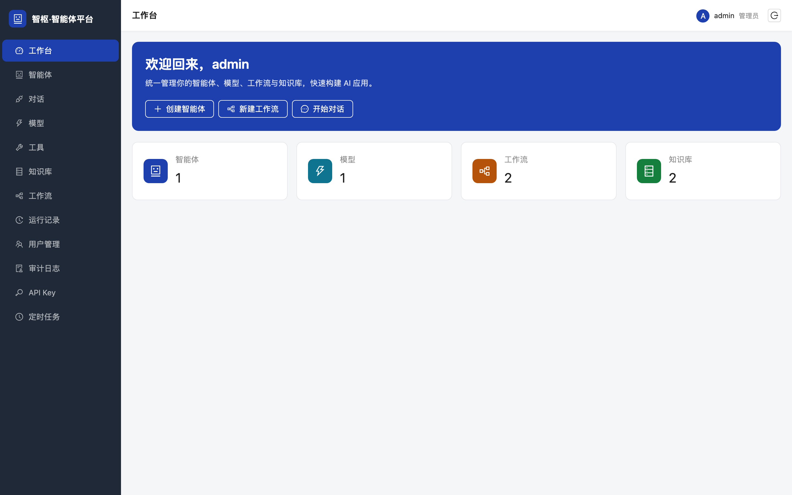
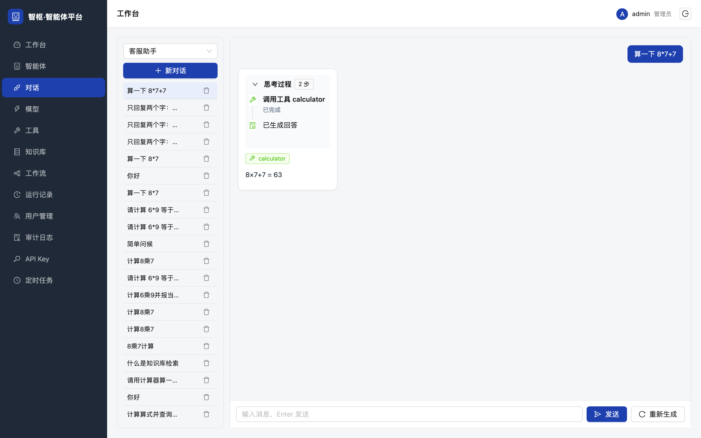
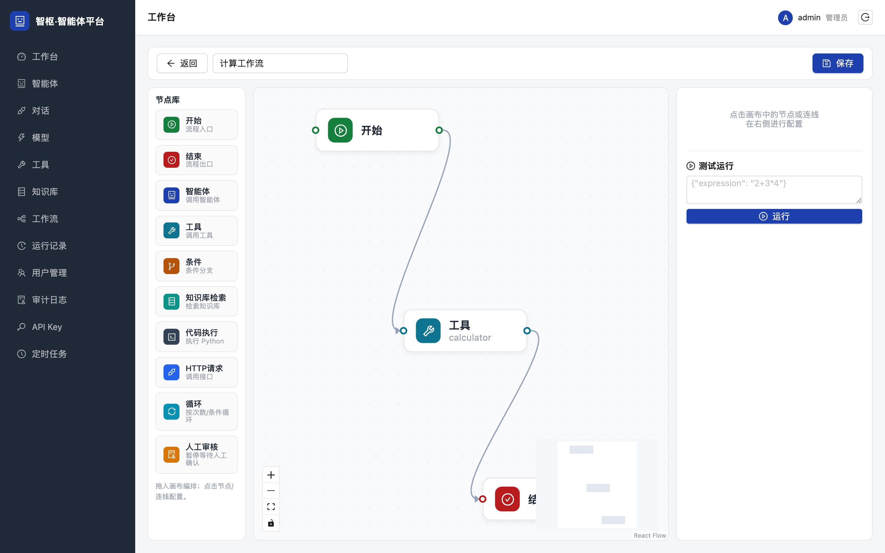
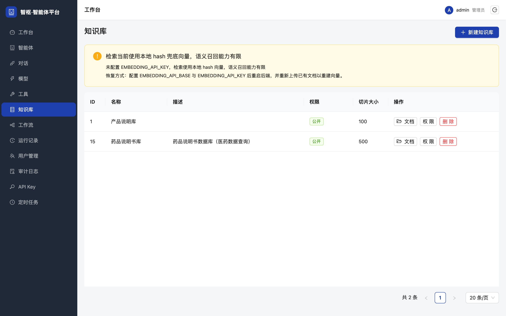
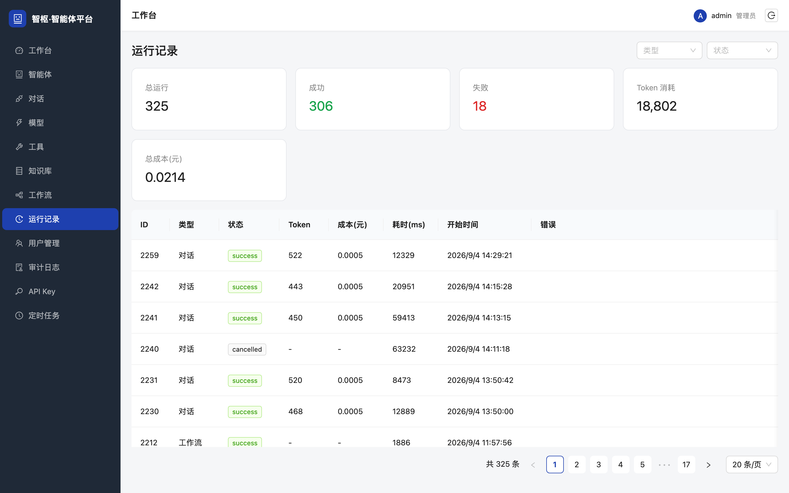

# 智枢 · 智能体平台

[](https://github.com/Rayden-Lei/agent-platform/actions/workflows/ci.yml)


可私有化部署的大模型智能体中台。把模型接入、智能体配置与发布、流式对话、RAG 知识库、可视化工作流编排、运行监控与审计、API Key 与定时调度放在一个控制台里，让团队用一套底座搭建自己的 AI 应用。



## 功能一览

| 模块 | 能力 |
|---|---|
| 模型接入 | 统一走 OpenAI 兼容协议，支持 DeepSeek、通义千问、月之暗面、智谱等厂商及自建推理服务；模型 API Key 加密入库，接口永不回传 |
| 智能体 | 提示词、模型、工具、知识库组合配置，版本发布与历史版本管理 |
| 对话 | SSE 流式输出，展示思考过程、工具调用与引用来源，支持中途中断，多轮记忆自动压缩为摘要 |
| 知识库 | 文档上传到 MinIO，按文件类型差异化分片，pgvector 向量检索与关键词检索混合召回，知识库级与切片级权限控制 |
| 工作流 | React Flow 画布拖拽编排，LangGraph 执行，10 类节点，人工审核节点可暂停后续跑 |
| 工具 | 内置工具供智能体与工作流调用，可按统一契约扩展 |
| 运行记录 | 对话与工作流的每次运行留痕，Token、成本、耗时统计，中断与失败统一收尾 |
| 管理 | 用户与角色、审计日志、API Key 与配额、定时任务（APScheduler） |

## 界面预览

<table>
  <tr>
    <td></td>
    <td></td>
  </tr>
  <tr>
    <td align="center">流式对话</td>
    <td align="center">工作流编辑器</td>
  </tr>
  <tr>
    <td></td>
    <td></td>
  </tr>
  <tr>
    <td align="center">知识库</td>
    <td align="center">运行记录与成本统计</td>
  </tr>
</table>

更多页面见 [docs/screenshots](docs/screenshots)。

## 架构

单体优先、内部模块化：一个 FastAPI 进程承载全部模块，靠目录与依赖方向划分边界，不拆微服务。

```
┌──────────────────────────────────────────────────────────────┐
│ 接入层   React 控制台（Vite 开发 / Nginx 静态）  REST API  SSE   │
├──────────────────────────────────────────────────────────────┤
│ 应用层   api/v1 路由 → services 业务                            │
│          认证 用户 模型 智能体 对话 会话 工具 知识库 工作流         │
│          运行记录 审计 API Key 定时任务                          │
├──────────────────────────────────────────────────────────────┤
│ 能力层   model_gateway 模型网关 │ rag 检索管道 │ workflow 引擎    │
│          tools 工具执行器 │ core 安全/鉴权/审计/调度器            │
├──────────────────────────────────────────────────────────────┤
│ 数据层   PostgreSQL + pgvector │ Redis（登录限流） │ MinIO（文档） │
└──────────────────────────────────────────────────────────────┘
```

依赖方向自上而下单向：路由只依赖服务，服务依赖能力层与数据层，能力层不反向依赖服务层。完整的核心链路（认证、对话、RAG、工作流、调度、运行记录生命周期、可观测性）与设计取舍见 [docs/02-架构设计.md](docs/02-架构设计.md)。

## 技术要点

- **工作流引擎**：把画布上的工作流 JSON 编译为 LangGraph 状态图执行，支持开始、结束、智能体、工具、条件分支、知识库检索、代码、HTTP、循环、人工审核 10 类节点；人工审核节点通过 `interrupt()` 暂停，管理端审批后用 `Command(resume=...)` 从断点续跑；节点之间用 `{{node_id.field}}` 引用上游输出。
- **RAG 检索**：向量检索与多关键词检索双路召回，RRF 融合后按词法覆盖率重排并做低分与断崖淘汰；对话前先把用户问题改写为多个子查询分别检索；召回前按切片权限快照硬过滤、重排后逐条鉴权，避免越权看到切片。
- **流式对话**：SSE 事件契约固定为 `citations`、`delta`、`tool_call`、`tool_result`、`done`、`error` 六类；客户端中断后服务端在 `finally` 里把已生成内容落库并将运行记录置为 `cancelled`，不留永久 running；中间件用纯 ASGI 实现，避免 `BaseHTTPMiddleware` 破坏流式响应。
- **API Key 与配额**：API Key 与 JWT 共用 Bearer 头按前缀分流，库里只存哈希；配额扣减用带前置条件的 `UPDATE ... WHERE used < quota` 按影响行数判断，并发下不会超扣，用尽返回 429；管理类接口默认拒绝 API Key。
- **可观测性**：每个请求分配 `X-Request-Id`，贯穿日志、响应头与错误体；三类异常统一出口；`/system/status` 汇总向量后端、登录限流、数据库、调度器的降级状态，前端据此提示。
- **工程约束**：列表接口统一服务端分页且每页上限 100；前端用请求序号丢弃过期响应；数据库变更全部落幂等迁移脚本；文档与代码同批更新。

## 技术栈

| 层 | 选型 |
|---|---|
| 后端 | Python 3.12、FastAPI、SQLAlchemy 2.0、Pydantic 2、LangGraph、LangChain、APScheduler |
| 数据 | PostgreSQL 16 + pgvector、Redis 7、MinIO |
| 前端 | React 18、TypeScript、Vite、Ant Design 5、React Flow、zustand、axios |
| 部署 | Docker Compose 一键部署，或裸机 uvicorn + Nginx |
| 质量 | pytest、GitHub Actions CI、tsc 类型检查 |

## 快速开始

### Docker Compose

```bash
cp .env.example .env        # 修改数据库密码、SECRET_KEY、AES_KEY 与向量模型配置
docker compose up -d --build
```

启动 api（8000）、web（18056）、postgres、redis、minio 五个容器，浏览器打开 `http://<主机>:18056`。默认管理员 `admin / admin123`，首次登录后请修改密码。

### 本地开发

要求 Python 3.12+（uv 管理）、Node 20+，以及可用的 PostgreSQL（pgvector）、Redis、MinIO。

```bash
# 后端
cd backend
uv venv .venv --python 3.12
uv pip install --python .venv/bin/python -r requirements.txt
cp .env.example .env                                   # 按 docs/08 修改连接信息
PGPASSWORD=<密码> .venv/bin/python scripts/setup_db.py # 建库与 vector 扩展，只需一次
.venv/bin/uvicorn app.main:app --host 0.0.0.0 --port 8000 --reload

# 前端
cd frontend
npm install
npm run dev -- --port 18056 --host 0.0.0.0
```

Vite 会把 `/api` 代理到 `http://127.0.0.1:8000`。环境变量、迁移脚本与排障见 [docs/08-运行与部署.md](docs/08-运行与部署.md)。

### 测试

```bash
cd backend
.venv/bin/pytest
```

CI 在每次 push 与 PR 时启动 pgvector 与 Redis 容器运行后端测试，并对前端做 `tsc --noEmit` 与构建。

## 目录结构

```
agent-platform/
├── backend/
│   ├── app/
│   │   ├── api/v1/          # 路由模块
│   │   ├── services/        # 业务逻辑
│   │   ├── model_gateway/   # OpenAI 兼容模型网关
│   │   ├── rag/             # 解析、分片、向量化、检索
│   │   ├── workflow/        # LangGraph 工作流引擎
│   │   ├── tools/           # 内置工具
│   │   ├── core/            # 鉴权、审计、请求上下文、调度器、分页
│   │   └── db/              # ORM 模型
│   ├── scripts/             # 建库、幂等迁移、联调脚本
│   ├── tests/               # pytest
│   └── .env.example
├── frontend/src/            # api / components / pages / store
├── docs/                    # 需求、架构、数据库、接口、规范、部署、路线
│   └── screenshots/         # 界面截图
├── docker-compose.yml
└── .env.example
```

## 文档

| 文档 | 内容 |
|---|---|
| [01-需求说明](docs/01-需求说明.md) | 功能需求、角色权限、实现状态、验收标准 |
| [02-架构设计](docs/02-架构设计.md) | 分层、代码结构、对话 / RAG / 工作流核心链路、设计决策 |
| [03-数据库设计](docs/03-数据库设计.md) | 表结构、外键语义、JSON 字段结构、迁移管理 |
| [04-接口设计](docs/04-接口设计.md) | 全部接口、响应结构、错误码、SSE 事件契约、分页与 API Key 契约 |
| [05-开发规范](docs/05-开发规范.md) · [06-后端规范](docs/06-后端规范.md) · [07-前端规范](docs/07-前端规范.md) | 开发纪律与写法约定 |
| [08-运行与部署](docs/08-运行与部署.md) | 本地开发、环境变量、迁移、两种部署、排障 |
| [09-演进路线](docs/09-演进路线.md) | 改进优先级与已知问题 |
| [10-差距分析](docs/10-差距分析.md) · [11-差距补齐PRD](docs/11-差距补齐PRD.md) · [12-差距补齐开发计划](docs/12-差距补齐开发计划.md) | 面向企业级中台的差距盘点与补齐计划 |

完整索引见 [docs/README.md](docs/README.md)。

## 已知局限

当前定位是单团队使用的 MVP，尚未做多租户隔离；已知问题与改进优先级见 [docs/09-演进路线.md](docs/09-演进路线.md)，与企业级中台的差距盘点见 [docs/10-差距分析.md](docs/10-差距分析.md)。

## License

[MIT](LICENSE)
